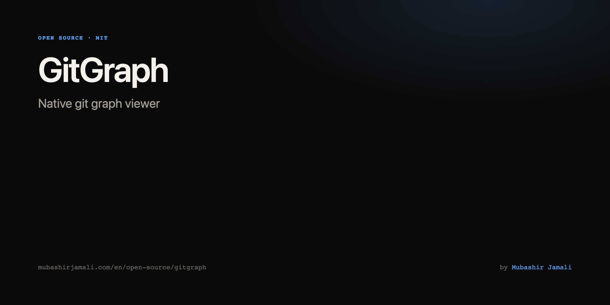
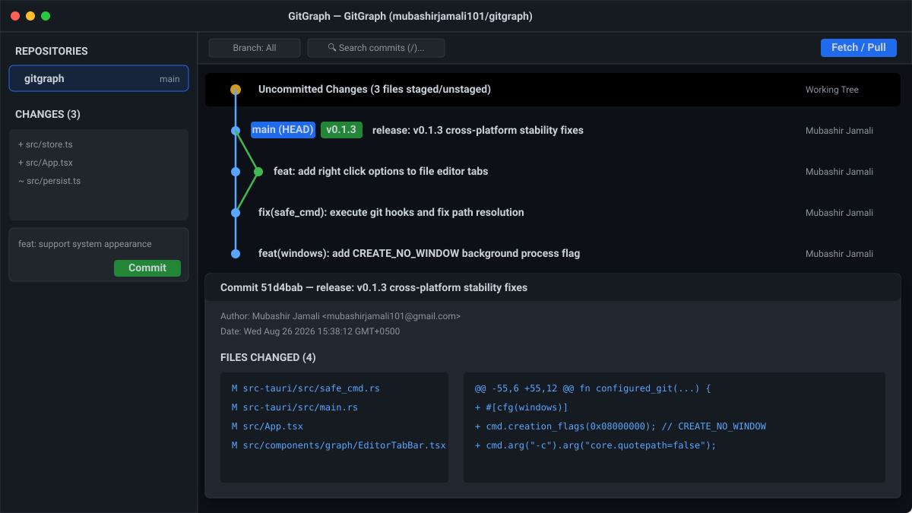
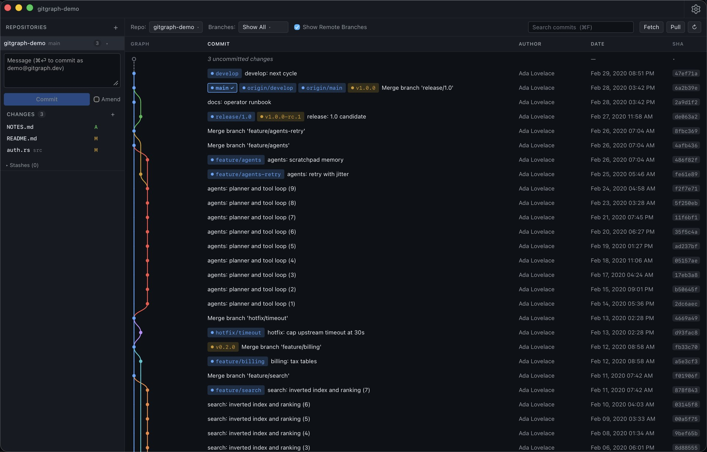
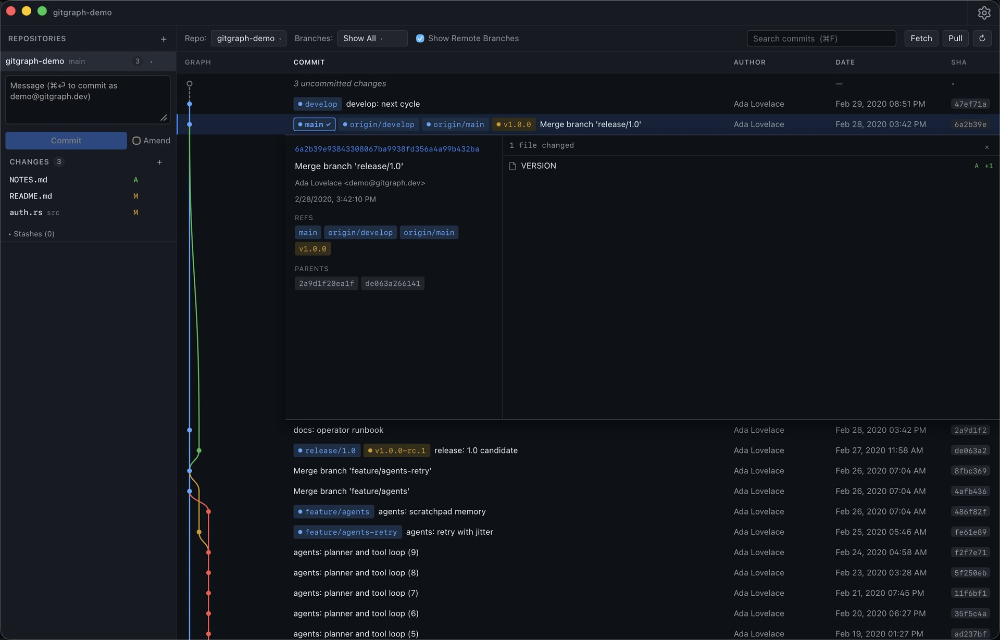
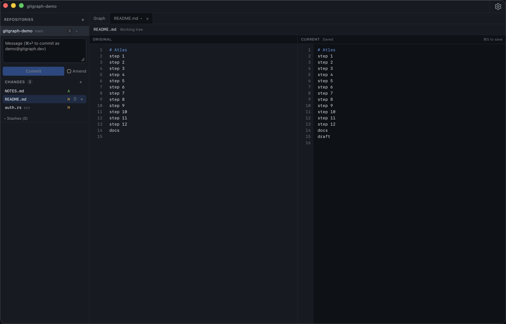
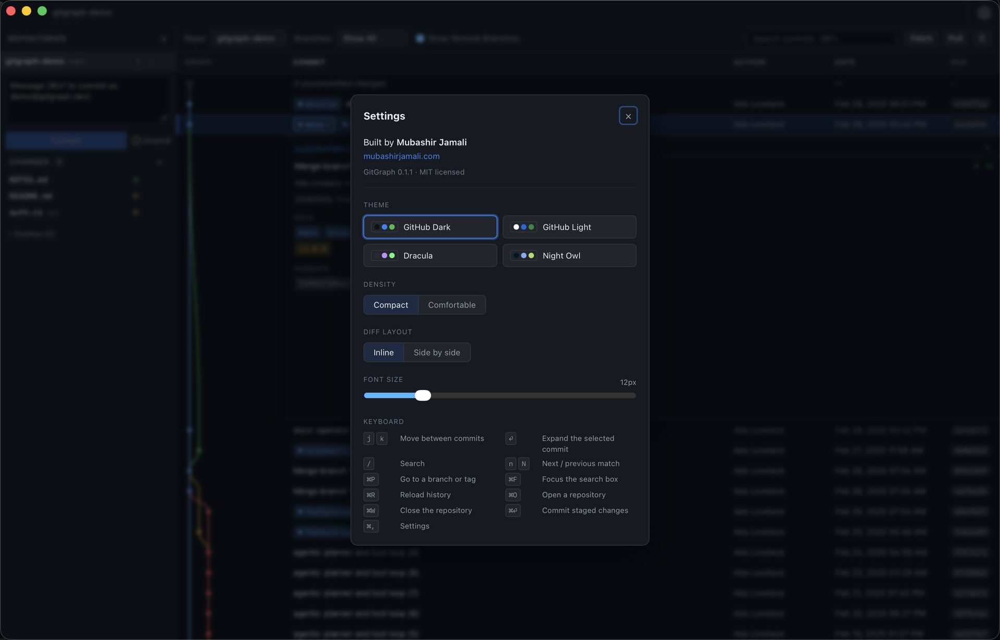

# GitGraph



A fast, native git‑graph viewer for macOS, Windows, and Linux. Built with Tauri 2 + Rust + React.
Designed to replace the "open VS Code just for its Git Graph extension" reflex.


## Screenshots











Portfolio: **[mubashirjamali.com/en/open-source/gitgraph](https://www.mubashirjamali.com/en/open-source/gitgraph)** · First release: [GitGraph 0.1](https://www.mubashirjamali.com/en/writing/gitgraph-first-release)

## What it does

- Repositories listed in a sidebar, each with its uncommitted changes, commit box and stashes; the graph follows the selection (or the toolbar's **Repo** menu)
- Per-repository scroll position, selection, expanded commit, search and branch filter, restored across switches **and app restarts**
- **Branches** filter and **Show Remote Branches**: the selection seeds the revwalk, so filtering removes commits rather than leaving edges to commits that are no longer drawn
- Commit graph drawn on a canvas beside a virtualized list: history loads in pages, with no commit-count ceiling
- Branch / tag / HEAD chips in VS Code Git Graph style (colored dot + monospace label)
- Search highlights and jumps (`Enter`, `n`, `N`) instead of filtering, so the graph never implies a parent/child link that does not exist
- Right-click a ref: check out, merge, rebase, push, rename, delete, fetch, pull, create branch, copy name
- Right-click a commit: create branch, create tag, cherry-pick, revert, reset (keep or discard changes), copy SHA or message
- Uncommitted work shown as the top row, with staged and unstaged changes listed separately — what you see staged is exactly what a commit would contain
- Stage / unstage per file or all at once, commit, and amend
- Stash list with push / pop / apply / drop
- Conflict banner for an interrupted merge / rebase / cherry-pick / revert, offering Continue or Abort
- Force-push detection: a push that would discard commits on the remote is gated by a typed confirmation and uses `--force-with-lease`
- Inline and side-by-side diffs with syntax highlighting and real per-side line numbers
- Auto-refresh: commits, checkouts and rebases made outside the app appear on their own
- Four themes (GitHub Dark, GitHub Light, Dracula, Night Owl), compact / comfortable density, font-size slider
- Keyboard: `j`/`k` or arrows to move, `Enter` to expand, `/` or `⌘F` to search, `n`/`N` between matches, `⌘R` refresh, `⌘O` open, `⌘P` go to branch/tag, `⌘W` close repository, `⌘,` settings
- Errors surface through an `ErrorBoundary`, non-blocking toasts, and a per-OS log at `app_log_dir()/gitgraph.log`

## Safety posture

Opening an unknown repo on disk does not mean running its code. Every subprocess `git` invocation goes through a hardened wrapper ([`src-tauri/src/safe_cmd.rs`](src-tauri/src/safe_cmd.rs)) that:

- Disables hook execution (`-c core.hooksPath=/dev/null`, `NUL` on Windows)
- Sets `-c safe.directory=*` and `-c protocol.allow=user`
- Scrubs hijack‑vector env vars (`GIT_SSH`, `GIT_SSH_COMMAND`, `GIT_ASKPASS`, `SSH_ASKPASS`, `GIT_EXTERNAL_DIFF`, `GIT_PAGER`, `GIT_EDITOR`, `GIT_PROXY_COMMAND`)
- Sets `GIT_TERMINAL_PROMPT=0` — nothing can block on a prompt no one can answer
- 30 s wall‑clock timeout (300 s for network verbs) with `kill_on_drop`
- Validates ref names and file paths before they reach `git` (no `@{`, `^`, `..`, `*`, `?`, `~`, `:`, control bytes, leading `-`, etc.)

The *repository* is untrusted; **you** are not. Your `~/.gitconfig` and the
system config are read normally, exactly as your shell reads them — that is
where credential helpers and your commit identity live. Hiding them
(`GIT_CONFIG_NOSYSTEM=1`, `GIT_CONFIG_GLOBAL=/dev/null`) would stop every
fetch, pull and push with "could not read Username" and silently attribute
commits to a hostname-derived identity, while doing nothing about the
repository's own config, which is the part that is actually untrusted. Known
gap: a repository's `.git/config` can still set its own `credential.helper`,
and git will run it.

Rust tests assert that hooks (`post-checkout`, `pre-commit`) do not fire through
this wrapper, and that the wrapper neither hides the user's config nor stops
scrubbing the hijack-vector environment.

[SECURITY.md](SECURITY.md) has the full threat model, the known gaps, and where
to report a vulnerability.

## Install

Download the installer for your platform from the [releases page](../../releases):

| Platform | What to open |
|----------|----------------|
| **macOS** | `.dmg` → double-click **GitGraph.app** (or drag it to Applications) |
| **Windows** | `.msi` or the NSIS `.exe` → next, next, finish |
| **Linux** | `.AppImage` (chmod +x and run), `.deb`, or `.rpm` |

Builds are **unsigned / not notarized** (no Apple Developer / code-signing cert in CI yet).
First launch on macOS:

1. Right-click the app → **Open**
2. Click **Open** again when Gatekeeper warns
3. If still blocked: System Settings → Privacy & Security → **Open Anyway**

### Build from source

See [docs/BUILD.md](docs/BUILD.md) for the full build flow (including the Homebrew-vs-rustup
gotcha that breaks universal macOS builds).

```bash
pnpm install
pnpm tauri build           # native arch
# DMG → src-tauri/target/release/bundle/dmg/GitGraph_*.dmg
```

## Develop

```bash
pnpm install
pnpm dev                       # Tauri dev server, hot reload
pnpm typecheck                 # tsc --noEmit
pnpm test                      # vitest (41 frontend tests)
cd src-tauri && cargo test     # 62 Rust tests incl. hook suppression
```

### Browser-only mode

The UI runs in a plain browser against a fixture generated from any real
repository — useful for UI work without a Rust build, and for driving
large-repo behaviour deterministically:

```bash
pnpm fixture /path/to/some/repo   # writes public/fixture.json
pnpm dev:mock                     # http://localhost:5199
```

`src/mock/core.ts` stands in for the Tauri IPC bridge; everything else is the
real application.

### Checking the graph against a real repository

```bash
cd src-tauri
GITGRAPH_E2E_REPO=/path/to/repo cargo test e2e -- --nocapture
```

Walks the whole history and asserts the invariants the renderer depends on:
every line leaving a row is continued by the next one, and paging reproduces
the walk exactly.

CI runs the same gates on every PR on macOS / Windows / Linux. See [.github/workflows/ci.yml](.github/workflows/ci.yml).

## Project structure

```
gitgraph/
├── scripts/gen-fixture.mjs     # Builds a mock-IPC fixture from any real repo
├── src/                        # React 19 + TypeScript frontend
│   ├── App.tsx                 # Window chrome, session restore, repo-changed events
│   ├── ipc.ts                  # The only place Tauri commands are called
│   ├── store.ts                # zustand: repos, filters, settings, all transitions
│   ├── persist.ts              # The only place localStorage is touched (gitgraph_v2)
│   ├── actions.ts              # Repository actions + the confirmations they need
│   ├── constants.ts            # Geometry, published to CSS as custom properties
│   ├── graph/
│   │   ├── layout.ts           # RowLayout — single source of truth for positions
│   │   ├── columns.ts          # Column widths that always add up to the pane
│   │   ├── geometry.ts         # How the graph column splits between lanes and badges
│   │   ├── changes.ts          # Change-type letter and colour, in one place
│   │   ├── dates.ts            # Commit date formatting, cached
│   │   └── rows.ts             # Working-tree row, search matching, summaries
│   ├── components/
│   │   ├── RepoView.tsx        # One repository: banner, list, menus, dialogs
│   │   ├── HomeScreen.tsx      # Open / scan / recent
│   │   ├── Dropdown.tsx        # Trigger + panel used by both toolbar pickers
│   │   ├── menus.ts            # Context-menu contents, as data
│   │   ├── sidebar/
│   │   │   ├── Sidebar.tsx         # Repository list, resizer
│   │   │   └── RepoChanges.tsx     # Staging and committing for the active repo
│   │   └── graph/
│   │       ├── GraphToolbar.tsx    # Repo, branch filter, remotes, search, actions
│   │       ├── CommitList.tsx      # Virtualization, search, keyboard, columns
│   │       ├── GraphCanvas.tsx     # Windowed canvas renderer
│   │       ├── CommitRow.tsx       # One row (memoized)
│   │       ├── CommitDetails.tsx   # Expanded commit panel
│   │       ├── WorkingTreePanel.tsx# Uncommitted changes: file lists + diff
│   │       ├── DiffView.tsx        # Inline + side-by-side
│   │       └── FileTree.tsx        # Folded folder tree with per-file stats
│   ├── hooks/
│   │   ├── useRepoAction.ts    # Run a git action: busy state, refresh, error toast
│   │   ├── useColumnResize.ts  # Column divider dragging
│   │   └── useScrollTop.ts     # Scroll position read from the DOM at render time
│   ├── mock/core.ts            # Stand-in for the Tauri IPC (pnpm dev:mock)
│   └── utils/highlightCache.ts # highlight.js output parsed into React elements
│
└── src-tauri/                  # Rust backend (Tauri 2)
    ├── capabilities/default.json  # Permissions the UI actually uses
    └── src/
        ├── main.rs             # Command registration only
        ├── repo.rs             # Open-repository registry + snapshot cache
        ├── graph/
        │   ├── lanes.rs        # Lane assignment → per-row segments
        │   ├── snapshot.rs     # Revwalk, branch filter, paging
        │   └── refs.rs         # Ref → commit mapping
        ├── diff.rs             # Single-pass diff collection
        ├── worktree.rs         # Staged vs unstaged
        ├── watch.rs            # Debounced .git watcher
        ├── safe_cmd.rs         # Hardened git subprocess wrapper
        ├── validate.rs         # Ref / path / sha / message validation
        └── commands/           # Thin command layer, grouped by area
```

See [AGENTS.md](AGENTS.md) for the long-form architecture / gotchas reference.

## Roadmap

Deferred to v1.1:

- Hunk‑level staging (parse `git diff -U0`, render gutter buttons, apply via `git apply --cached -`)
- Blame view with hover popover
- File history (`git log --follow -- <path>`)
- Interactive rebase UI
- Reflog
- Code signing + notarization + auto‑update

## License

[MIT](LICENSE) © Mubashir Jamali.

## Contact

Bugs and feature requests: [open an issue](https://github.com/mubashirjamali101/gitgraph/issues).
Portfolio page: <https://mubashirjamali.com/en/open-source/gitgraph>.
Anything else, including security reports: <gitgraph@mubashirjamali.com>.
